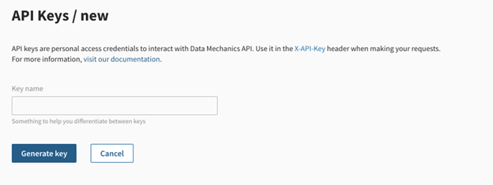
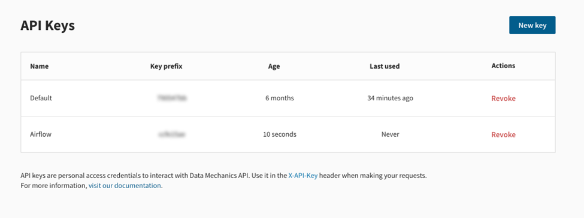

# API keys
Set up your access with the Data Science API.

To interact with the Data Science API, you need to use API key to identify yourself.

## Create API Keys

Create a new API key, which creates the personal access credentials required for the Data Mechanics API.

1. To create your first API key, go to [API Keys/new](https://<your-cluster-url>/dashboard/api-keys/new).  
    
   
1. Enter a unique **Key name** that will allow you to differentiate from other keys. 
   
1. Click **Generate Key**. This will generate and return the new API key.
   
1. Copy the returned API key value.

> **Important: Treat your API key like a password**   
    <ul>
    <li>Do not share your API key.</li>
    <li>Do not commit your API key to a public Github repository.</li>
    <li>If your API key is compromised, [revoke it](#revoke-a-key) and create a new one.</li>
    <li>It is recommended to rotate your API keys frequently to increase security.</li>
    </ul>

**Result:** You have now created your API key. To access the Data Science API, set the Y-Api-Key request header value to your API key. 

## Managing your API keys

View the list of active API keys at [https://<your-cluster-url>/dashboard/api-keys/](https://<your-cluster-url>/dashboard/api-keys/).

### Find your keys

You can locate your keys either by the key's **Name** or by **Key prefix**, which contains first characters of key.

### Identify unused keys 

Identify unused keys, by viewing the **Last used** column, which indicated when was last time that key was last used to access the Data Science API.

### Revoke a key

In the **Actions** column, you can click **Revoke** to revoke an API key.

> Revoking a key is final so make sure it's not used in the scheduler or by one of your RI systems.

# Prepare the Data Science Metastore

One way to ensure connectivity is to create inbound rule for TCP on port 9472 and to ensure the database is publicly accessible. 
On AWS, you have several choices, one of which is RDS. RDS allows you to create managed services for Aurora, MariaDB, PostgreSQL,
0racle, Microsoft SQL Server.

This step prepares the Data Science metastore, which is used to create the Science-schema. You need to retrieve following two sql scripts:

